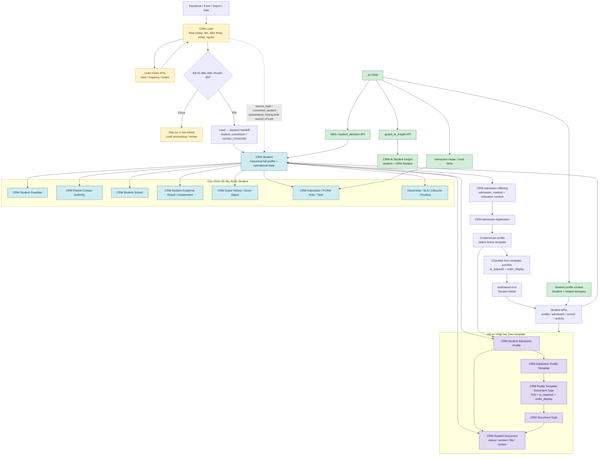
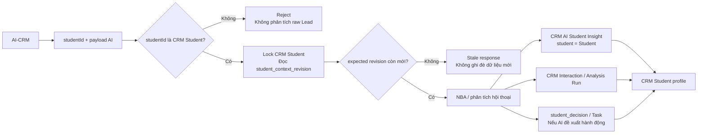

# Flow hiện tại: Lead, Student và AI-CRM

Tài liệu này mô tả mô hình backend hiện tại sau khi chuyển `CRM Student` thành
aggregate chính. `CRM Lead` chỉ giữ dữ liệu intake thô, provenance và các adapter
legacy cần thiết cho dữ liệu cũ.

## 1. Flow nghiệp vụ tổng quát

## 2. ERD quan hệ chính

```mermaid
erDiagram
    CRM_LEAD ||--o| CRM_STUDENT : "source_lead / converted_student"
    CRM_STUDENT ||--o{ CRM_STUDENT_ADMISSION_PROFILE : "has profiles"
    CRM_ADMISSION_PROFILE_TEMPLATE ||--o{ CRM_STUDENT_ADMISSION_PROFILE : "applies to"
    CRM_ADMISSION_PROFILE_TEMPLATE ||--o{ CRM_PROFILE_TEMPLATE_DOCUMENT_TYPE : "defines"
    CRM_DOCUMENT_TYPE ||--o{ CRM_PROFILE_TEMPLATE_DOCUMENT_TYPE : "belongs to templates"
    CRM_STUDENT ||--o{ CRM_STUDENT_DOCUMENT : "owns"
    CRM_STUDENT_ADMISSION_PROFILE ||--o{ CRM_STUDENT_DOCUMENT : "contains"
    CRM_DOCUMENT_TYPE ||--o{ CRM_STUDENT_DOCUMENT : "describes"

    CRM_STUDENT ||--o{ CRM_STUDENT_GUARDIAN : "has guardians"
    CRM_STUDENT ||--o{ CRM_PARENT_CONTACT_AUTHORITY : "governs contact authority"
    CRM_STUDENT ||--o{ CRM_STUDENT_SCHOOL : "has school history"
    CRM_STUDENT ||--o{ CRM_STUDENT_ACADEMIC_RESULT : "has academic results"
    CRM_STUDENT ||--o{ CRM_STUDENT_ASSESSMENT : "has assessments"
    CRM_STUDENT ||--o{ CRM_SCORE_HISTORY : "has score history"
    CRM_STUDENT ||--o{ CRM_INTERACTION : "has interactions"
    CRM_STUDENT ||--o{ CRM_STUDENT_ANALYSIS_RUN : "has analysis runs"
    CRM_STUDENT ||--o{ CRM_STUDENT_COMMAND_RECEIPT : "owns command receipts"

    CRM_LEAD ||--o{ CRM_STUDENT_CONTACT_CONVERSION : "legacy conversion source"
    CRM_STUDENT ||--o{ CRM_STUDENT_CONTACT_CONVERSION : "conversion target"
```

`CRM_PROFILE_TEMPLATE_DOCUMENT_TYPE` là bảng junction của quan hệ N:N giữa
`CRM Admission Profile Template` và `CRM Document Type`. Các thuộc tính nghiệp vụ
của từng loại hồ sơ nằm tại junction, gồm `is_required`, `requirement_mode`,
`min_required`, `quantity`, `order_display` và hướng dẫn hiển thị.

## 3. Flow AI-CRM trên Student profile

Quy tắc quan trọng:

- AI-CRM chỉ cần làm việc với `CRM Student` canonical.
- `CRM AI Student Insight` là projection AI chính của `CRM Student`; field `student`
  là liên kết canonical bắt buộc về Student.
- `CRM Lead` chỉ còn xuất hiện ở intake, provenance, conversion boundary và dữ liệu
  lịch sử. Một Lead chưa có Student canonical không được dùng để tạo insight hoặc
  interaction phân tích.
- `student_context_revision` trên Student dùng để chống AI ghi đè trên context đã
  thay đổi.

## Ý nghĩa khối Ownership / SLA / Lifecycle / Routing

Khối này là một nhóm logic trong flowchart, không phải một DocType duy nhất. Nó gom
bốn năng lực vận hành xoay quanh `CRM Student`:

- **Ownership:** xác định nhân viên/team đang phụ trách Student và lưu lịch sử thay
  đổi ownership.
- **SLA:** theo dõi hạn phản hồi, lần follow-up, trạng thái đúng hạn/quá hạn và
  escalation.
- **Lifecycle:** quản lý stage/status của Student cùng lý do và audit trail khi chuyển
  stage.
- **Routing:** chọn campus/team/pool/staff phù hợp để phân công Student theo rule,
  năng lực và phạm vi.

Mũi tên `CRM Student --> Ownership / SLA / Lifecycle / Routing` nghĩa là Student là
aggregate anchor và nguồn phân quyền; AI chỉ có thể đề xuất NBA, còn command thay đổi
ownership, SLA, lifecycle hoặc routing phải đi qua backend policy và actor được phép.

## 4. Admission application materialization

`CRM Admission Application` lấy `admission_method` từ `CRM Admission Offering`.
Khi application được tạo qua command API hoặc tạo trực tiếp bằng Frappe, backend
sẽ chọn template `Active` loại `academic_admission` theo phương thức xét và ưu tiên
template có `education_program` trùng với Student. Sau đó backend tạo hoặc reuse
`CRM Student Admission Profile` ở trạng thái `Draft` và trả checklist từ bảng
`CRM Profile Template Document Type`.

`admission_method` không bắt buộc ở raw intake. Nếu chưa xác định tại intake, workflow
sau chuyển đổi có thể cập nhật `CRM Student.admission_method` qua Student API; lúc tạo
application, Offering vẫn là nguồn xác thực cuối cùng. `CRM Student Document` chỉ
được tạo khi học sinh thực sự nộp file, không tạo placeholder cho mục checklist.
